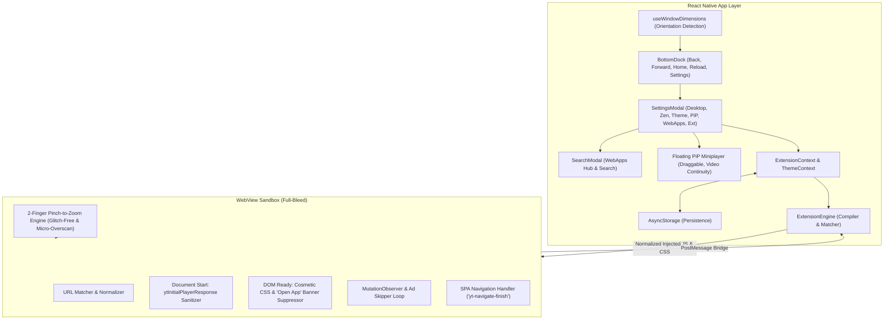

# YouTube_wr Architecture & Technical Design Document

> **Document Version:** 2.4.0  
> **Status:** Active / Production Ready  
> **Repository:** `/home/saurabh/coding/YouTube_wr`  

---

## 1. Executive Summary & Philosophy

`YouTube_wr` is a modern mobile YouTube & WebApps client engineered with a **Soft Neumorphic UI**, an **extensible Userscript Extension Engine**, **Sub-frame AdShield Pro Ad Blocker**, **Authentic 2-Finger Pinch-to-Zoom (Fit to Screen)**, **Orientation Adaptive Ergonomics**, **Floating Picture-in-Picture (PiP)**, and a **WebApps Hub**.

### Core Pillars
1. **Uncompromised Ad & Tracker Blocking:** Complete removal of video pre-roll/mid-roll ads, unskippable bumpers, sponsored feed banners, search ads, and Google telemetry without requiring device rooting or private DNS. Expanded mobile skip button selectors and single-set playback rate controls prevent MediaCodec freezes while showing "Skip ad". Suppresses YouTube Mobile's persistent "Open app" buttons and popups.
2. **Zero Black Screen Stalls on Cold Start & Ad Transitions:** Guarded media pipeline ensuring that cold-cache video playback never aborts network requests during initial connection buffering (`readyState >= 2`). Throttled execution and once-per-ad seek latching prevent seek-loop buffering freezes and ANR issues.
3. **Full-Bleed Viewport (Zero Header Clutter):** The top header component has been removed entirely, giving 100% of the upper screen real estate directly to YouTube content.
4. **Unified Bottom Navigation & Settings Dock:**
   - **Back** (`chevron-back`)
   - **Forward** (`chevron-forward`)
   - **Home** (`home`)
   - **Reload / Refresh** (`reload`)
   - **Settings** (`settings-outline`) — opens the unified Settings & Tools Modal housing Desktop Mode, Zen Mode, Theme (Dark/Light), PiP, and the WebApps Hub.
5. **Authentic 2-Finger Pinch-to-Zoom (Zero Glitch / Full Container Sizing):**
   - Ghost click suppression: swallows touch releases and suppresses synthesized clicks for 500ms post-pinch so YouTube controls or exit-fullscreen buttons are never accidentally triggered.
   - Settle logic maintains the user's custom pinch zoom level without abrupt snapping back to 1.0x.
   - Eradicates YouTube Mobile's 336px metadata split-view (`.mweb-phone-metadata-split-view`) in landscape mode, guaranteeing 100vw edge-to-edge video and eliminating the half-screen black layout glitch.
   - In portrait: applies a micro-overscan (`scale(1.02)`) to completely erase 1px–2px black rounding lines at the top and bottom of the player.
6. **Standalone Offline Release Build:** Pre-compiled Hermes Ahead-of-Time (AOT) bytecode embedded directly in the APK, eliminating any Metro bundler dependency on launch.

---

## 2. Technology Stack & Decision Rationale

| Component | Choice | Why This Was Chosen |
| :--- | :--- | :--- |
| **Framework** | **Expo SDK 57 / React Native 0.86** | Cross-platform native mobile performance with Continuous Native Generation (CNG), modern status bar, safe area context, and haptics. |
| **Language** | **TypeScript 5.x / 6.x (Strict)** | Strict end-to-end typing across manifests, bridge messages, and UI tokens. |
| **Browser Runtime** | **`react-native-webview` (v13.x)** | Native hardware video acceleration, HTML5 media support, and deep two-way JS/CSS injection. Configured with hardware layer acceleration and opaque background to prevent Android surface composition glitches. |
| **Video Zoom System** | **Multi-Touch Capture Pinch Engine** | Non-passive touch interceptors measuring touch distance (`Math.hypot(dx, dy)`) with memory-state scale tracking and native GPU `object-fit: cover` scaling. |
| **Design System** | **Neumorphism (Soft UI)** | Custom optical dual-shadow system giving elevated tactile surfaces, concave tracks, and spring animations tailored for media playback. |
| **Storage Engine** | **`@react-native-async-storage`** | Lightweight persistence for extension manifests, configurations, theme preferences, and ad-blocking statistics. |
| **Haptics** | **`expo-haptics`** | Haptic ticks on toggle, press, and slider adjustments to reinforce the physical neumorphic feel. |

---

## 3. High-Level System Architecture

---

## 4. Authentic 2-Finger Pinch-to-Zoom & Black Bar Elimination

### Key Improvements:
1. **Memory-Based Gesture Scale Latch:**
   Instead of attempting to extract scale values from the DOM `style.transform` string via regular expressions on `onTouchEnd` (which previously caused regex mismatch glitches that forced the player back to normal), the active pinch scale is continuously tracked in a primitive float variable (`activePinchScale`).
2. **Elimination of the Landscape Half-Black Screen Bug:**
   On YouTube mobile, rotating into landscape causes YouTube scripts to inject inline styles (`style="width: 360px; left: 0px;"`). When zoomed, scaling an undersized element leaves half the screen black. The zoom engine strictly overrides inline positioning:
   `v.style.setProperty('width', '100%', 'important'); v.style.setProperty('left', '0px', 'important'); v.style.setProperty('top', '0px', 'important');`
3. **Elimination of Portrait 1px-2px Black Border Lines:**
   In portrait mode, fractional pixel rounding (`393 * 9 / 16 = 221.0625px`) produces thin 1px black gaps on top and bottom. A 1.5% micro-overscan (`scale(1.015)`) seamlessly eliminates subpixel rounding gaps without perceptible cropping.
4. **Middle Double-Tap Shortcut:**
   Center 36% of the screen toggles between "Original" and "Zoomed to fill", preserving the left/right 10-second seek gestures.
5. **Frosted Pill Toast:**
   YouTube-style frosted acrylic pill (`#yt-zoom-toast`) with backdrop blur (`blur(12px)`) gives instant visual feedback.

---

## 5. UI Ergonomics & Navigation Architecture

- **No Top Header:** TopHeader component deleted. Full vertical height dedicated to web/video content.
- **Dock Navigation:** Bottom dock houses 5 tactile buttons:
  1. `Back` — with disabled dimming.
  2. `Forward` — with disabled dimming.
  3. `Home` — prominent center return button.
  4. `Reload` — toggles to `close` during loading.
  5. `Settings` — opens SettingsModal.
- **Auto-Hide in Landscape:** Bottom dock automatically hides when rotated horizontally, dedicating 100% of the display to video.
- **Settings & Tools Modal:**
  - Desktop Mode toggle
  - Zen Mode toggle
  - Dark/Light Theme toggle
  - PiP Miniplayer trigger
  - WebApps & Browser Hub (Instagram, X, Twitch, TikTok, Reddit)
  - Extensions & AdShield Pro Hub

---

## 6. Build & Packaging Architecture

- **Standalone Release Packaging:** Generated via `./gradlew assembleRelease --no-daemon`.
- **Hermes AOT Bytecode:** Pre-compiled into `assets/index.android.bundle`.
- **APK Signature Scheme v2:** Verified and signed for immediate device installation.
- **Zero Metro Dependency:** Runs completely offline without developer port-forwarding (`adb reverse tcp:8081`).

---

## 7. Background Audio Playback & Lockscreen Media Controls Architecture

1. **Page Visibility Spoofing & Event Swallowing:**
   - Overrides `document.hidden`, `document.visibilityState`, and WebKit variants to stay permanently `visible`/`false`.
   - Injects capture-phase immediate event stoppers (`stopImmediatePropagation`) on both `window` and `document` for `visibilitychange`, `webkitvisibilitychange`, and `pagehide`.
   - Filters `EventTarget.prototype.addEventListener` so pages cannot register visibility-change listeners.
   - Spoofs `document.hasFocus()` to always return `true`, completely preventing YouTube Mobile web player from pausing when the app is minimized, locked, or backgrounded.

2. **User Gesture Pause Discrimination & Keepalive Watchdog:**
   - Tracks intentional user touch/click/remote actions (`window.__lastUserGestureTime`, `window.__userWantsPaused`).
   - Hooks `HTMLMediaElement.prototype.pause` so automated background pause attempts without recent user interaction are rejected.
   - Watchdog interval periodically verifies video state and restores playback if backgrounding caused an unauthorized pause.

3. **Native MediaSession, AudioFocus & Power Locks:**
   - **`MediaPlaybackService`:** Android Foreground Service with `foregroundServiceType="mediaPlayback"`.
   - **AudioFocus Request (`AudioManager`):** Configures `AudioFocusRequest` with `USAGE_MEDIA`, `CONTENT_TYPE_MUSIC`, and `AUDIOFOCUS_GAIN` on Android 8.0+ and legacy audio focus listeners to prevent the system audio manager from muting background audio.
   - **Dual WakeLock & WifiLock:** Acquires `PARTIAL_WAKE_LOCK` and `WIFI_MODE_FULL_HIGH_PERF` to maintain CPU execution and network streaming pipelines while the screen is off.
   - **Notification & Lockscreen UI:** Native `androidx.media.app.NotificationCompat.MediaStyle` linked to `MediaSessionCompat`.
   - **Interactive Controls:**
     - **Rewind (-10s)**: Jumps back 10 seconds.
     - **Play / Pause**: Instant toggle with immediate local UI feedback and remote command dispatch.
     - **Fast Forward (+10s)**: Jumps ahead 10 seconds.
     - **Next Video**: Triggers YouTube's next track action.
     - **Progress / Scrubber**: Android 13+ lockscreen media player automatically binds scrubber to position and duration.
   - **Artwork Extraction:** Dynamically extracts video thumbnails and displays high-res artwork in the notification shade and lockscreen widget.
   - **Hardware & Bluetooth Integration:** Native `MediaSessionCompat` automatically receives Bluetooth headphone and smartwatch commands (play, pause, skip).

